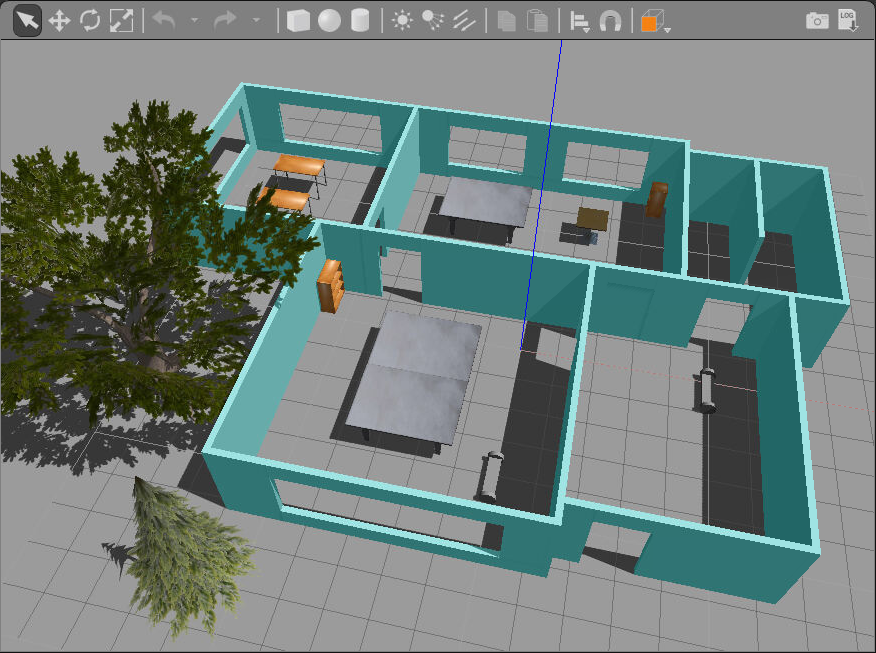

## Project: Build My World




#### Directory Structure
```
# tree .
.
├── build
│   ├── CMakeCache.txt
│   ├── CMakeFiles
│   │   ├── 3.5.1
│   │   │   ├── CMakeCCompiler.cmake
│   │   │   ├── CMakeCXXCompiler.cmake
│   │   │   ├── CMakeDetermineCompilerABI_C.bin
│   │   
│   │   :   :
│   │   
│   ├── cmake_install.cmake
│   ├── libhello.so
│   └── Makefile
├── CMakeLists.txt
├── model
│   ├── building
│   │   ├── model.config
│   │   └── model.sdf
│   └── robot
│       ├── model.config
│       └── model.sdf
├── script
│   └── hello.cpp
└── world
    └── crayon_office

13 directories, 41 files
```