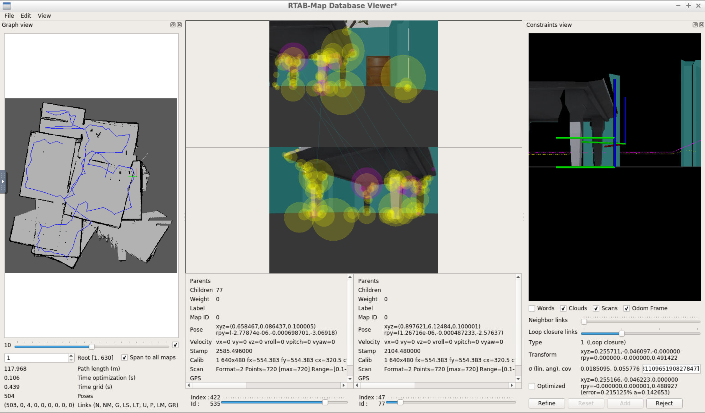

## Project: Map My World Robot?



#### Directory Structure
```
% tree .
.
├── CMakeLists.txt
├── ball_chaser
│   ├── CMakeLists.txt
│   ├── launch
│   │   └── ball_chaser.launch
│   ├── package.xml
│   ├── src
│   │   ├── drive_bot.cpp
│   │   └── process_image.cpp
│   └── srv
│       └── DriveToTarget.srv
├── my_robot
│   ├── CMakeLists.txt
│   ├── config
│   │   ├── base_local_planner_params.yaml
│   │   ├── costmap_common_params.yaml
│   │   ├── global_costmap_params.yaml
│   │   └── local_costmap_params.yaml
│   ├── launch
│   │   ├── amcl.launch
│   │   ├── localization.launch
│   │   ├── mapping.launch
│   │   ├── robot_description.launch
│   │   └── world.launch
│   ├── maps
│   │   ├── map.pgm
│   │   └── map.yaml
│   ├── meshes
│   │   └── hokuyo.dae
│   ├── package.xml
│   ├── urdf
│   │   ├── my_robot.gazebo
│   │   └── my_robot.xacro
│   └── worlds
│       └── crayon_office.world
├── rtabmap.db
└── teleop_twist_keyboard
    ├── CHANGELOG.rst
    ├── CMakeLists.txt
    ├── README.md
    ├── package.xml
    └── teleop_twist_keyboard.py
```