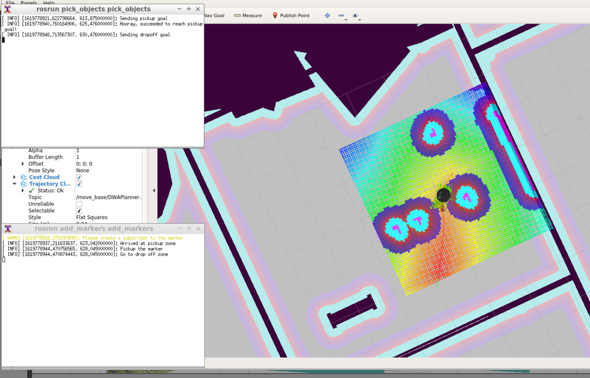

## Project: Home Service Robot



#### ROS packages
You have to use these official ROS pachages for this project.

- [gmapping](http://wiki.ros.org/gmapping)
- [turtlebot_teleop](http://wiki.ros.org/turtlebot_teleop)
- [turtlebot_rviz_launchers](http://wiki.ros.org/turtlebot_rviz_launchers)
- [turtlebot_gazebo](http://wiki.ros.org/turtlebot_gazebo)

#### How to simulate home service robot: navigating to pick up and deliver virtual objects

```
% cd catkin_ws
% catkin_make
% source devel/setup.bash
% ./src/script/home_service.bash
```

#### Directory Structure
```
% tree .
.
├── CMakeLists.txt
├── add_markers
│   ├── CMakeLists.txt
│   ├── include
│   │   └── add_markers
│   ├── package.xml
│   └── src
│       └── add_markers.cpp
├── map
│   ├── crayon_office.world
│   ├── map.pgm
│   └── map.yaml
├── pick_objects
│   ├── CMakeLists.txt
│   ├── include
│   │   └── pick_objects
│   ├── package.xml
│   └── src
│       └── pick_objects.cpp
├── rvizConfig
│   └── homeServiceRobot.rviz
├── scripts
│   ├── add_markers.sh
│   ├── home_service.sh
│   ├── launch.sh
│   ├── pick_objects.sh
│   ├── test_navigation.sh
│   └── test_slam.sh
├── slam_gmapping
│   ├── gmapping
│   ├── ...
├── turtlebot
│   ├── turtlebot_teleop
│   ├── ...
├── turtlebot_interactions
│   ├── turtlebot_rviz_launchers.md
│   ├── ...
└── turtlebot_simulator
    ├── turtlebot_gazebo
    ├── ...
```